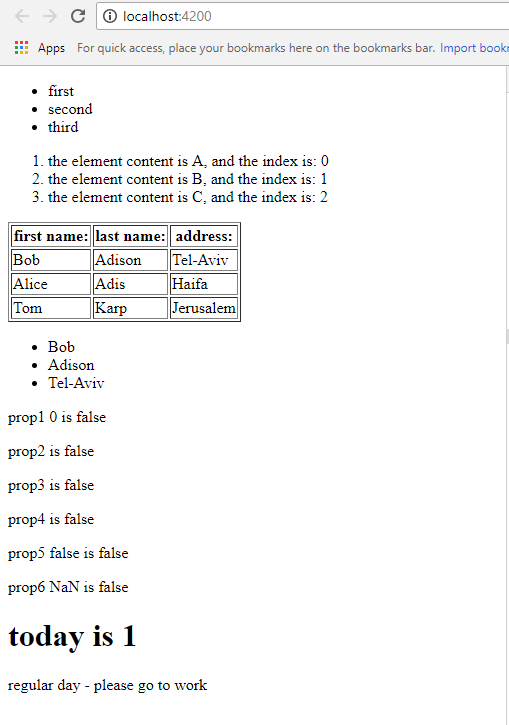

# angular app - with `*ngFor` and `*ngIf`

## Project goals
* create new angular app
* create new component
* render component into component
* interpolation `{{}}`
* `*ngFor` and `*ngIf`

### Run this app with the following commands:
```bash
npm i
ng serve --open
```

### Get this result:
