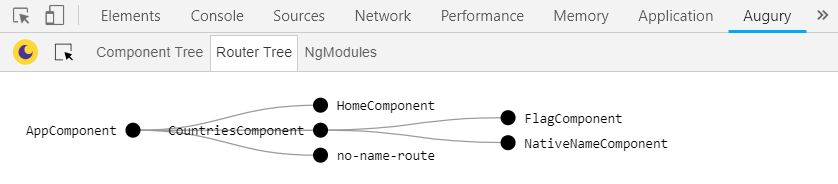

#   Angular Nested routing
---
## Project goals
* creating and running basic angular project
* creating new components and rendering into html 
* using one way binding - from html to ts- `{{}}`
* using one way binding - from ts to html - `()`
* using `router-outlet' 

## Routing diagram
 

## Running the project (on local mode)

* Run `npm init` to install all the requiered packages from `package.json`
* Run `ng serve` to visit this site at `localhost:4200`

## See live demo
https://fierce-sands-82874.herokuapp.com/router3