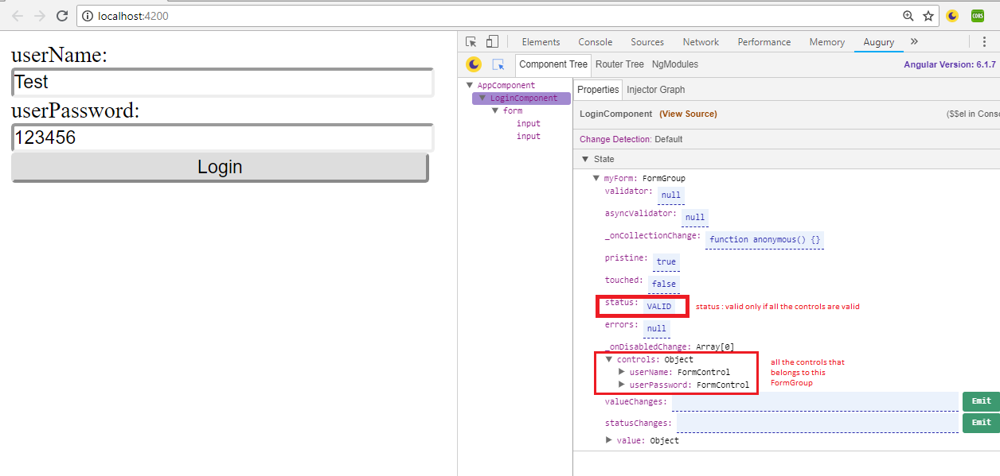
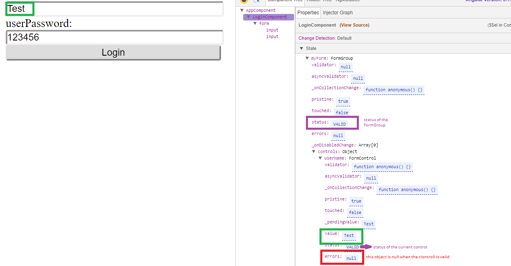
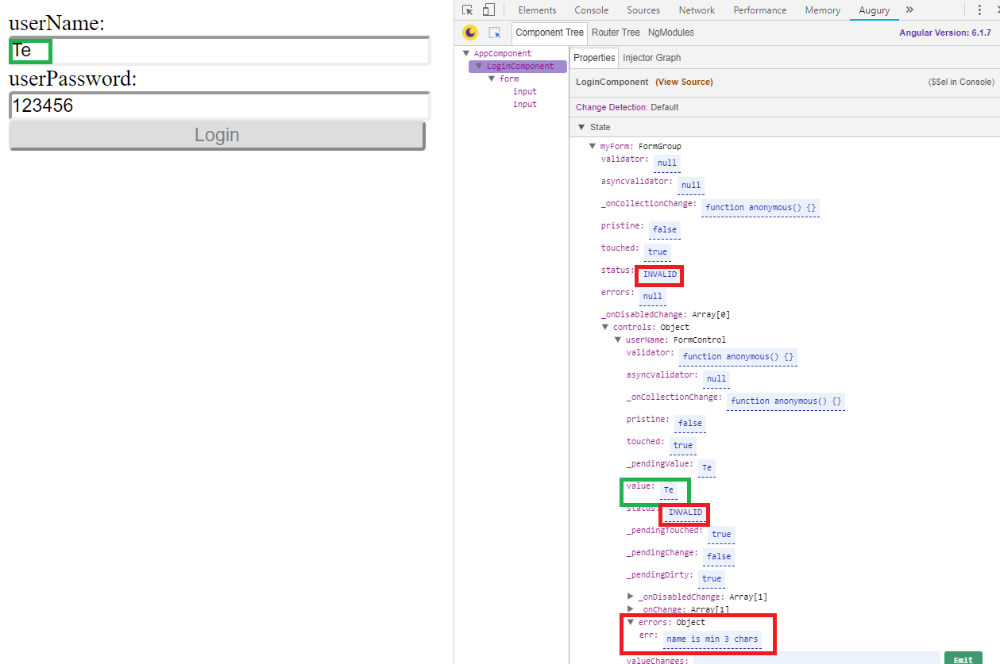

# Reactive forms
#   Angular pipes
---
## Project goals
* creating and running basic angular project
* creating new components and rendering into html 
* using reactive forms and validations

## Running the project (on local mode)

* Run `npm init` to install all the requiered packages from `package.json`
* Run `ng serve` to visit this site at `localhost:4200`

## See live demo
https://fierce-sands-82874.herokuapp.com/forms

*NOTE*: add to `imports` array in `src/app/app.module.ts`:
  ```
  imports: [
    BrowserModule,
    FormsModule,
    ReactiveFormsModule
  ]
  ```

## Accessing the FormGroup properties:
   
   



